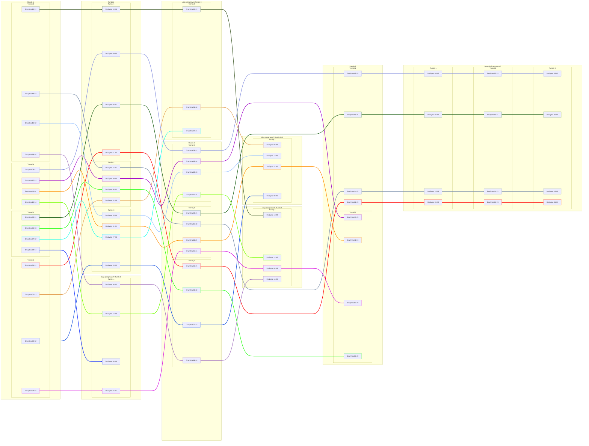

FAJNY PROJEKT

```mermaid
%%{init:{'flowchart':{'nodeSpacing': 50, 'rankSpacing':'200'}}}%%

flowchart LR
    classDef dr01 stroke:#f00
    classDef dr02 stroke:#e4a256
    classDef dr03 stroke:#1652e0
    classDef dr04 stroke:#d916e0
    classDef dr05 stroke:#1c6116
    classDef dr06 stroke:#29ff17
    classDef dr07 stroke:#17ffea
    classDef dr08 stroke:#1732ff
    classDef dr09 stroke:#8a94e0
    classDef dr10 stroke:#a309c9
    classDef dr11 stroke:#ff8e00
    classDef dr12 stroke:#74ff00
    classDef dr13 stroke:#496334
    classDef dr14 stroke:#768ba8
    classDef dr15 stroke:#92bfff
    classDef dr16 stroke:#a576c0

    dr01 --> dr01.2 --> dr01.3 -->            dr01.5 --> dr01.6 --> dr01.7 --> dr01.8
    dr02 --> dr02.2 --> dr02.3 --> dr02.4
    dr03 --> dr03.2 --> dr03.3 --> dr03.4
    dr04 --> dr04.2 --> dr04.3 --> dr04.4 --> dr04.5
    dr05 --> dr05.2 --> dr05.3 -->            dr05.5 --> dr05.6 --> dr05.7 --> dr05.8
    dr06 --> dr06.2 --> dr06.3 -->            dr06.5
    dr07 --> dr07.2 --> dr07.3
    dr08 --> dr08.2
    dr09 --> dr09.2 --> dr09.3 -->            dr09.5 --> dr09.6 --> dr09.7 --> dr09.8
    dr10 --> dr10.2 --> dr10.3 -->            dr10.5
    dr11 --> dr11.2 --> dr11.3 --> dr11.4 --> dr11.5

    dr12 --> dr12.2 --> dr12.3 --> dr12.4
    dr13 --> dr13.2 --> dr13.3 --> dr13.4
    dr14 --> dr14.2 --> dr14.3 -->            dr14.5 --> dr14.6 --> dr14.7 --> dr14.8
    dr15 --> dr15.2 --> dr15.3 --> dr15.4
    dr16 --> dr16.2 --> dr16.3 --> dr16.4

    linkStyle default stroke-width:4px

    linkStyle 0 stroke:#f00
    linkStyle 1 stroke:#f00
    linkStyle 2 stroke:#f00
    linkStyle 3 stroke:#f00
    linkStyle 4 stroke:#f00
    linkStyle 5 stroke:#f00

    linkStyle 6 stroke:#e4a256
    linkStyle 7 stroke:#e4a256
    linkStyle 8 stroke:#e4a256

    linkStyle 9 stroke:#1652e0
    linkStyle 10 stroke:#1652e0
    linkStyle 11 stroke:#1652e0

    linkStyle 12 stroke:#d916e0
    linkStyle 13 stroke:#d916e0
    linkStyle 14 stroke:#d916e0
    linkStyle 15 stroke:#d916e0

    linkStyle 16 stroke:#1c6116
    linkStyle 17 stroke:#1c6116
    linkStyle 18 stroke:#1c6116
    linkStyle 19 stroke:#1c6116
    linkStyle 20 stroke:#1c6116
    linkStyle 21 stroke:#1c6116

    linkStyle 22 stroke:#29ff17
    linkStyle 23 stroke:#29ff17
    linkStyle 24 stroke:#29ff17

    linkStyle 25 stroke:#17ffea
    linkStyle 26 stroke:#17ffea

    linkStyle 27 stroke:#1732ff

    linkStyle 28 stroke:#8a94e0
    linkStyle 29 stroke:#8a94e0
    linkStyle 30 stroke:#8a94e0
    linkStyle 31 stroke:#8a94e0
    linkStyle 32 stroke:#8a94e0
    linkStyle 33 stroke:#8a94e0

    linkStyle 34 stroke:#a309c9
    linkStyle 35 stroke:#a309c9
    linkStyle 36 stroke:#a309c9

    linkStyle 37 stroke:#ff8e00
    linkStyle 38 stroke:#ff8e00
    linkStyle 39 stroke:#ff8e00
    linkStyle 40 stroke:#ff8e00

    linkStyle 41 stroke:#74ff00
    linkStyle 42 stroke:#74ff00
    linkStyle 43 stroke:#74ff00


    linkStyle 44 stroke:#496334
    linkStyle 45 stroke:#496334
    linkStyle 46 stroke:#496334


    linkStyle 47 stroke:#768ba8
    linkStyle 48 stroke:#768ba8
    linkStyle 49 stroke:#768ba8
    linkStyle 50 stroke:#768ba8
    linkStyle 51 stroke:#768ba8
    linkStyle 52 stroke:#768ba8

    linkStyle 53 stroke:#92bfff
    linkStyle 54 stroke:#92bfff
    linkStyle 55 stroke:#92bfff

    linkStyle 56 stroke:#a576c0
    linkStyle 57 stroke:#a576c0
    linkStyle 58 stroke:#a576c0


    subgraph Runda 1
        direction LR
        subgraph Turniej 1
            direction LR
            dr01[Drużytna 01 #1]:::dr01
            dr02[Drużytna 02 #3]:::dr02
            dr03[Drużytna 03 #2]:::dr03
            dr04[Drużytna 04 #4]:::dr04
        end
        subgraph Turniej 2
            direction LR
            dr05[Drużytna 05 #1]:::dr05
            dr06[Drużytna 06 #3]:::dr06
            dr07[Drużytna 07 #2]:::dr07
            dr08[Drużytna 08 #4]:::dr08
        end
        subgraph Turniej 3
            direction LR
            dr09[Drużytna 09 #1]:::dr09
            dr10[Drużytna 10 #3]:::dr10
            dr11[Drużytna 11 #2]:::dr11
            dr12[Drużytna 12 #4]:::dr12
        end
        subgraph Turniej 4
            direction LR
            dr13[Drużytna 13 #1]:::dr13
            dr14[Drużytna 14 #3]:::dr14
            dr15[Drużytna 15 #2]:::dr15
            dr16[Drużytna 16 #4]:::dr16
        end
    end


    subgraph Runda 2
        direction LR
        subgraph Turniej 1
            direction LR
            dr01.2[Drużytna 01 #2]:::dr01 
            dr05.2[Drużytna 05 #1]:::dr05
            dr09.2[Drużytna 09 #3]:::dr09
            dr13.2[Drużytna 13 #4]:::dr13
        end
        subgraph Turniej 2
            direction LR
            dr02.2[Drużytna 02 #4]:::dr02
            dr06.2[Drużytna 06 #2]:::dr06
            dr10.2[Drużytna 10 #3]:::dr10
            dr14.2[Drużytna 14 #1]:::dr14
        end
        subgraph Turniej 3
            direction LR
            dr03.2[Drużytna 03 #2]:::dr03
            dr07.2[Drużytna 07 #4]:::dr07
            dr11.2[Drużytna 11 #1]:::dr11
            dr15.2[Drużytna 15 #3]:::dr15
        end
    end

    subgraph Liga przegranych Runda 2
        subgraph Turniej 4
            direction LR
            dr04.2[Drużytna 04 #1]:::dr04
            dr08.2[Drużytna 08 #4]:::dr08
            dr12.2[Drużytna 12 #3]:::dr12
            dr16.2[Drużytna 16 #2]:::dr16
        end
    end


    subgraph Runda 3
        direction LR
        subgraph Turniej 1
            direction LR
            dr05.3[Drużytna 05 #1]:::dr05
            dr14.3[Drużytna 14 #2]:::dr14
            dr11.3[Drużytna 11 #3]:::dr11

            dr04.3[Drużytna 04 #4]:::dr04
        end
        subgraph Turniej 2
            direction LR
            dr01.3[Drużytna 01 #1]:::dr01 
            dr06.3[Drużytna 06 #2]:::dr06
            dr03.3[Drużytna 03 #3]:::dr03

            dr16.3[Drużytna 16 #4]:::dr16
        end
        subgraph Turniej 3
            direction LR
            dr09.3[Drużytna 09 #1]:::dr09
            dr10.3[Drużytna 10 #2]:::dr10
            dr15.3[Drużytna 15 #3]:::dr15

            dr12.3[Drużytna 12 #4]:::dr12
        end
    end

    subgraph Liga przegranych Runda 3
        subgraph Turniej 4
            direction LR
            dr13.3[Drużytna 13 #1]:::dr13
            dr02.3[Drużytna 02 #2]:::dr02
            dr07.3[Drużytna 07 #4]:::dr07
        end
    end


    subgraph Liga przegranych Runda 4 v2
        direction LR
        subgraph Turniej 1
            direction LR
            dr11.4[Drużytna 11 #1]:::dr11
            dr03.4[Drużytna 03 #2]:::dr03
            dr15.4[Drużytna 15 #3]:::dr15
            
            dr02.4[Drużytna 02 #4]:::dr02
        end
    end

    subgraph Liga przegranych Runda 4
        subgraph Turniej 2
            direction LR

            dr04.4[Drużytna 04 #1]:::dr04
            dr16.4[Drużytna 16 #2]:::dr16
            dr12.4[Drużytna 12 #3]:::dr12
            
            dr13.4[Drużytna 13 #4]:::dr13
        end
    end


    subgraph Runda 5
        direction LR
        subgraph Turniej 1
            direction LR
            dr05.5[Drużytna 05 #1]:::dr05
            dr09.5[Drużytna 09 #2]:::dr09
            dr01.5[Drużytna 01 #3]:::dr01 
            dr14.5[Drużytna 14 #1]:::dr14

        end

        subgraph Turniej 2
            direction LR
            dr06.5[Drużytna 06 #2]:::dr06
            dr10.5[Drużytna 10 #3]:::dr10
            dr11.5[Drużytna 11 #4]:::dr11
            
            dr04.5[Drużytna 04 #4]:::dr04
        end
    end

    subgraph Wyłanianie wygranych
        direction TB
        subgraph Turniej 1
            direction LR
            dr05.6[Drużytna 05 #1]:::dr05
            dr09.6[Drużytna 09 #2]:::dr09
            dr01.6[Drużytna 01 #3]:::dr01 
            dr14.6[Drużytna 14 #1]:::dr14
        end

        subgraph Turniej 2
            direction LR
            dr05.7[Drużytna 05 #1]:::dr05
            dr09.7[Drużytna 09 #2]:::dr09
            dr01.7[Drużytna 01 #3]:::dr01 
            dr14.7[Drużytna 14 #1]:::dr14
        end

        subgraph Turniej 3
            direction LR
            dr05.8[Drużytna 05 #1]:::dr05
            dr09.8[Drużytna 09 #2]:::dr09
            dr01.8[Drużytna 01 #3]:::dr01 
            dr14.8[Drużytna 14 #1]:::dr14
        end
    end

```
